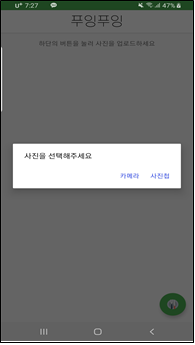
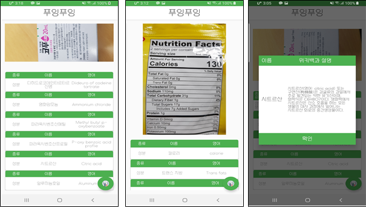

# 푸잉푸잉 - etri open api 공모전 대상

# 푸잉푸잉

작은 글씨로 인해 알아보기 어려운 문제와 외국어에 대한 해석 어려움을 해결 해주기 위해 식품의 성분표 사진만 찍으면 성분표의 성분과 재료에 대한 정보를 알려주는 어플리케이션

# 순서도

# 시퀀스 다이어그램

# 시작화면

- 스플래쉬화면을 이용 → 자체적인 이미지 생성

- 사진첩 및 카메라를 이용하여 사용자가 원하는 사진 추가

# 성분 분석

# 성분 및 재료에 대한 설명

# 기대효과

- 사진만 찍으면 되는 간편한 사용법으로 스마트폰에 익숙하지 않은 사람도 식품 성분표에 대한 정보를 얻을 수 있으므로 식품을 구매할 때 도움이 될 수 있습니다.

- OCR 기능을 통하여 사진에서 글자를 인식하므로 작은 공간에 빽빽하게 쓰여진 작은 성분들을 쉽게 인지할 수 있습니다.

- 번역기능을 제공하여 외국어로 되어있는 성분에 대해서도 알레르기로 인한 부작용을 방지할 수 있습니다.

- 약품이나 식품의 성분에 대한 지식이 부족한 사용자들도 위키백과 QA API의 자세한 설명을 확인할 수 있습니다.

# 같이 만든 개발자

- [이상민](https://github.com/tkdals2317)
- [권혁찬](https://github.com/HyeokChan)
- [지규빈](https://github.com/jie1029)

# 부족한 부분

- 애플리케이션을 처음만들어서 코드가 깔끔하지가 않다.. → 나중에 리팩토링
